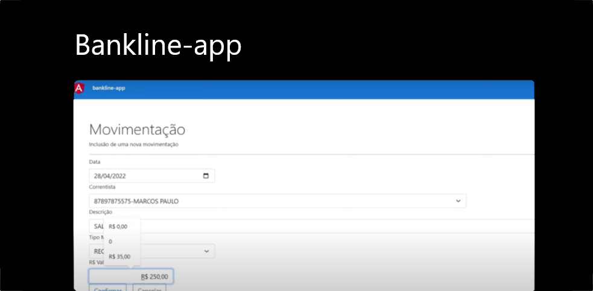

  

## 💻 Projeto
Esta aplicação é fruto de um programa de ensino da Digital Innovation One junto ao Santander. Bankline-app é uma SPA que se comunica, via requisições https, baseadas na arquitetura REST, com uma API (Bankline-api, disponível neste mesmo repositório git). Através do consumo desta api, a aplicação permite que o usuário realizae operações bancárias básicas como: criar correntistas, pesquisar correntitas, realizar movimentações nas contas e pesquisar tais movimentações.

Para visualizar o preview do projeto acesse o [link](https://st-bankline-app.netlify.app/).

## 🚀 Tecnologias

Este projeto foi desenvolvido com as seguintes tecnologias:
 - JavaScript
 - TypeScript
 - Node.Js
 - Angular 13
 - Angular HttpClient
 - Angular Router
 - Bootstrap 5
